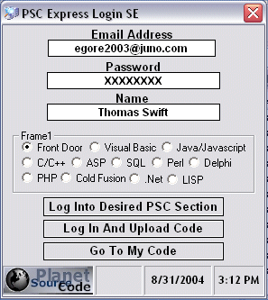



## PSC Express Login SE \(Updated\)

### Description

PSC Express Login SE holds the users login & password. As well as launching default browser & logs the user into any desired code section of PSC automatically. I got sick of constantly getting logged out of PSC, so I created PSC Express Login. It makes logging in a breeze & uploading code a piece of cake. You can also download my Internet Explorer Toolbar Integrator here on PSC & itegrate this right into your browsers toolbar. This is the last one I'm going to build so folks please remember to vote if you find this program useful.
 
### More Info
 

             |
---                |---
**Submitted On**   |2004-08-31 15:38:30
**By**             |[Thomas Swift](https://github.com/Planet-Source-Code/PSCIndex/blob/master/ByAuthor/thomas-swift.md)
**Level**          |Intermediate
**User Rating**    |5.0 (20 globes from 4 users)
**Compatibility**  |VB 6\.0
**Category**       |[Internet/ HTML](https://github.com/Planet-Source-Code/PSCIndex/blob/master/ByCategory/internet-html__1-34.md)
**World**          |[Visual Basic](https://github.com/Planet-Source-Code/PSCIndex/blob/master/ByWorld/visual-basic.md)
**Archive File**   |[PSC\_Expres1788088312004\.zip](https://github.com/Planet-Source-Code/thomas-swift-psc-express-login-se-updated__1-55928/archive/master.zip)

